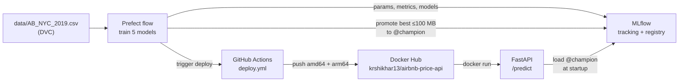

# NYC Airbnb Price Prediction: an end-to-end MLOps practice project

This project predicts a New York City Airbnb listing's nightly price (USD) from its location, room type and booking activity. The model is deliberately modest. The project is really about the deployment flow around it: versioned data, tracked experiments, a model registry, a containerised API, scheduled retraining, CI, and continuous deployment that a new model triggers.

Documentation:
- To build this project yourself from scratch, follow https://shikharkumar13.github.io/NYC-Airbnb-Price-Prediction-MLOps/airbnb_mlops_guide.html
- To see how the project was actually built, read [`implementation.md`](implementation.md), the build log. It records every detour, bug and fix, with real IDs and dates.



## Results

The models were trained on 38,771 listings and evaluated on 9,693 held-out listings. Errors are in dollars.

| Model | RMSE | MAE | R² | Size |
|---|---|---|---|---|
| RandomForest, 100 trees | $77.53 | $43.39 | 0.479 | 326 MB |
| RandomForest, 300 trees, depth 10 (champion) | $78.75 | $43.81 | 0.463 | 39 MB |
| GradientBoosting, 100, lr 0.1 | $81.13 | $44.90 | 0.430 | 3.9 MB |
| GradientBoosting, 200, lr 0.05 | $81.21 | $44.92 | 0.429 | 7.4 MB |
| LinearRegression (baseline) | $83.54 | $47.08 | 0.395 | 0.3 MB |

The champion rule is the lowest RMSE among models of 100 MB or less. The API downloads the champion at startup and keeps it in memory. The forest with unlimited depth is $1.22 better but 8 times larger, so the rule skips it and prints a note saying so. RMSE decides because it penalises large dollar misses most.

## Key decisions

- The model trains on the log of the price, and the conversion is built into it. Price is heavily skewed (median $106, max $10,000), so the models train on `log1p(price)`. `TransformedTargetRegressor` applies `expm1` inside `.predict()`, so every caller gets dollars and nobody can forget the conversion.
- Cleaning drops `$0` prices (11 rows, which are data errors) and prices above $800 (about the 99th percentile, 420 rows). A missing `reviews_per_month` means the listing has no reviews, so it's filled with 0 and not the mean.
- `neighbourhood` is a high-cardinality categorical with 221 values. It's one-hot encoded with `handle_unknown="ignore"`, so an unseen neighbourhood can't crash the API, and a test checks this.
- The model isn't baked into the image. The API loads `models:/AirbnbPriceModel@champion` at startup, so a new champion needs a restart and not a rebuild.
- One shared module (`features.py`) holds every cleaning and preprocessing rule, so the four training entry points can't drift apart.

## Project layout

| Path | Purpose |
|---|---|
| `features.py` | Load, clean, split, build the model, evaluate |
| `train.py` | Baseline LinearRegression, saved locally |
| `track_experiments.py` | The 5 configs, each logged as an MLflow run (with its model size) |
| `registry.py` | The selection rule, registration, and moving the `@champion` alias |
| `orchestrate_training.py` | Prefect flow: load (with retries), train ×5, promote, trigger deploy |
| `schemas.py` / `main.py` | Pydantic validation (NYC bounds and so on) and the FastAPI app |
| `Dockerfile`, `requirements-serve.txt` | API image: slim, non-root, fails fast if MLflow is down |
| `docker-compose.yml` | MLflow and the API together, with the API waiting for MLflow's healthcheck |
| `.github/workflows/ci.yml` | On every PR: throwaway MLflow, seed a champion, run the tests, build the image |
| `.github/workflows/deploy.yml` | On demand: build for amd64 and arm64 and push to Docker Hub |
| `scripts/` | The CI sample and seeding, and `trigger_deploy.py` (GitHub API) |
| `tests/` | 46 tests covering features, schemas, the API, tracking, the registry, the deploy trigger and the real champion |

## Setup

```bash
uv venv --python 3.11 .venv
source .venv/bin/activate          # in every new terminal
uv pip install -r requirements.txt "dvc==3.67.1"
dvc pull                           # fetches data/AB_NYC_2019.csv from the DVC remote
```

> [!WARNING]
> If `mlflow` or `prefect` fails with `cannot import name 'service' from 'google.protobuf'`, your terminal is running Anaconda's copy. Check `which mlflow`, then run `conda deactivate` and `source .venv/bin/activate`.

## Run it

The quickest way is Docker Compose, which starts the MLflow server (host port 5001) and the API (host port 8001) together. The API waits until MLflow's healthcheck passes:

```bash
docker compose up -d          # MLflow UI → http://127.0.0.1:5001 · API → http://127.0.0.1:8001/docs
docker compose logs -f api    # watch it load @champion
docker compose down           # stop (data stays in ./mlflow.db and ./mlartifacts)
```

Compose reuses this folder's `mlflow.db` and `mlartifacts/`, so don't run a host `mlflow server` at the same time. After promoting a new champion, run `docker compose restart api`.

You can also run each part by hand. Each server needs its own terminal with the venv active. This project runs MLflow on port 5001, because macOS AirPlay Receiver uses 5000.

```bash
# Terminal 1: MLflow tracking server + registry
mlflow server --backend-store-uri sqlite:///mlflow.db --artifacts-destination ./mlartifacts \
  --host 0.0.0.0 --port 5001 \
  --allowed-hosts "localhost:*,127.0.0.1:*,host.docker.internal:*,mlflow-server:*"

# Terminal 2: Prefect server (for flow history and scheduling)
prefect server start

# Terminal 3: work
export MLFLOW_TRACKING_URI=http://127.0.0.1:5001
python train.py                    # baseline sanity check
python orchestrate_training.py     # retrain all 5 and promote the best to @champion
uvicorn main:app --port 8000       # API → http://127.0.0.1:8000/docs  (pick another port if 8000 is taken)
```

Scheduled weekly retraining (Mondays 03:00 UTC), active while this process runs:
```bash
python orchestrate_training.py --serve
```

Run the published image:
```bash
docker run -d -p 8001:8000 -e MLFLOW_TRACKING_URI=http://host.docker.internal:5001 \
  krshikhar13/airbnb-price-api:latest
curl -s localhost:8001/health
```

An example prediction:
```bash
curl -s -X POST localhost:8000/predict -H 'Content-Type: application/json' -d '{
  "neighbourhood_group": "Manhattan", "neighbourhood": "Midtown",
  "latitude": 40.7549, "longitude": -73.984, "room_type": "Entire home/apt",
  "minimum_nights": 2, "number_of_reviews": 20, "reviews_per_month": 1.0,
  "calculated_host_listings_count": 1, "availability_365": 180}'
# {"predicted_price":244.25,"currency":"USD"}
```

## Tests

```bash
pytest                                              # unit tests; registry tests skip without a server
MLFLOW_TRACKING_URI=http://127.0.0.1:5001 pytest    # + tests against the real @champion
```

## CI/CD

Every pull request runs `.github/workflows/ci.yml`:
1. The test job installs `requirements.txt` and starts a throwaway MLflow server. It then trains a quick baseline on the committed 2,000-row sample (`tests/fixtures/listings_sample.csv`), promotes it to `@champion`, and runs the full test suite.
2. The build-image job builds the API's Docker image. It only runs if the test job passes, and it doesn't push the image anywhere.

CI uses the sample because the real dataset lives in a DVC remote on a laptop, which GitHub's runners can't reach.

`.github/workflows/deploy.yml` handles deployment and only runs when triggered, either from the Actions tab or by the Prefect flow after it promotes a new champion. The flow does this through `scripts/trigger_deploy.py`, which needs `GITHUB_REPO` and a fine-grained `GITHUB_TOKEN` with Actions: Read and write. The workflow pushes `latest`, `model-v<N>` and the commit SHA to Docker Hub for both `linux/amd64` and `linux/arm64`, and it needs the repository secrets `DOCKERHUB_USERNAME` and `DOCKERHUB_TOKEN`.

## Known limitations

- Accuracy is modest (R² of about 0.46). The data has location, room type and booking activity, but nothing about size, bedrooms or amenities.
- Artifact storage grows by about 377 MB per retrain, mostly from the oversized forest that never gets promoted. Old runs and their models need periodic cleanup with `mlflow gc` (see Appendix E of the guide).
- The DVC remote and the MLflow server are local to one laptop. A team setup would move both to shared storage (for example S3) and a hosted server.
